<p align="center">
  
</p>

# Vigilance Météo France

[](https://github.com/Pulpyyyy/meteo_france_vigilance/actions/workflows/validate.yml)
[](https://github.com/hacs/integration)
[](https://github.com/Pulpyyyy/meteo_france_vigilance/blob/main/CHANGELOG.md)
[](LICENSE)

La carte de vigilance de Météo-France dans Home Assistant (API publique
**DPVigilance v1**), avec sa carte Lovelace livrée dans le composant.

Remplace le montage à base de `command_line` + `jq` + `local_file` +
automatisation de rafraîchissement partagé sur le forum HACF : une entrée de
configuration, deux capteurs par département, deux caméras, une comosition de cartes lovelace.

| Thème clair | Thème sombre |
|:---:|:---:|
| 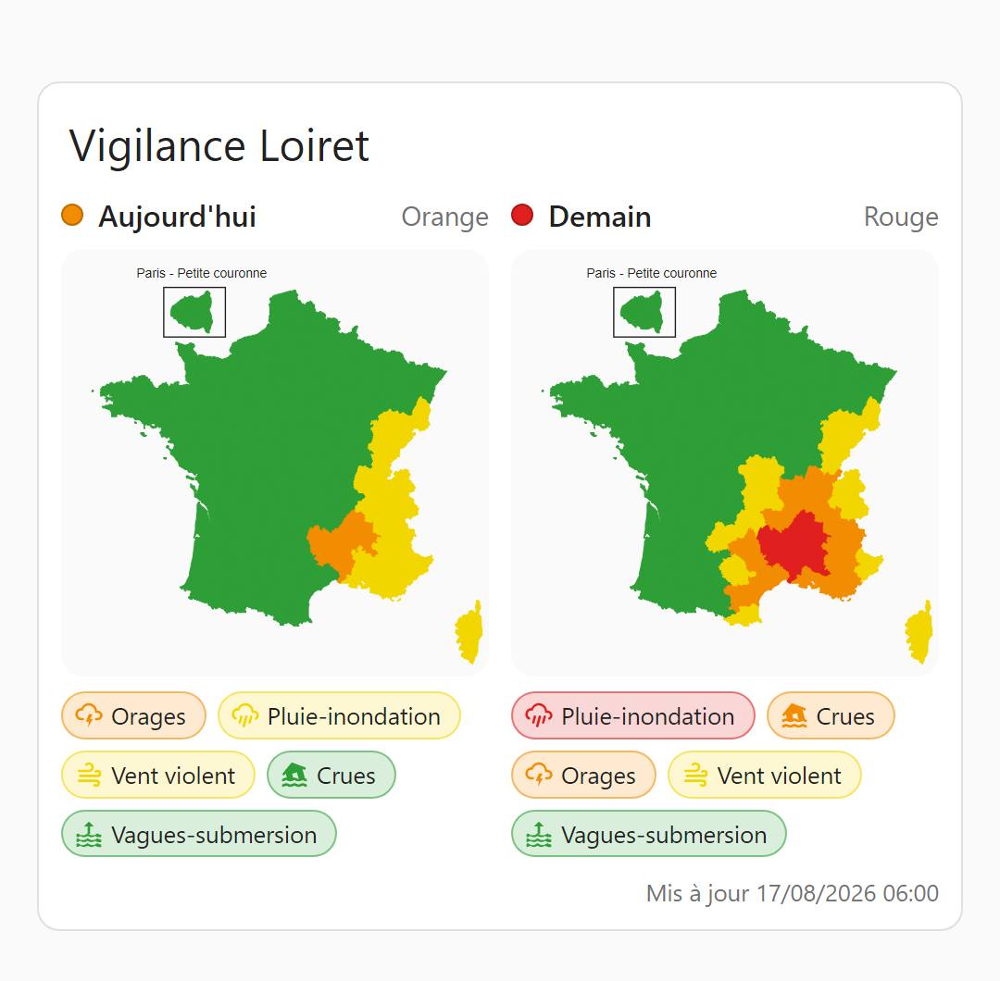 | 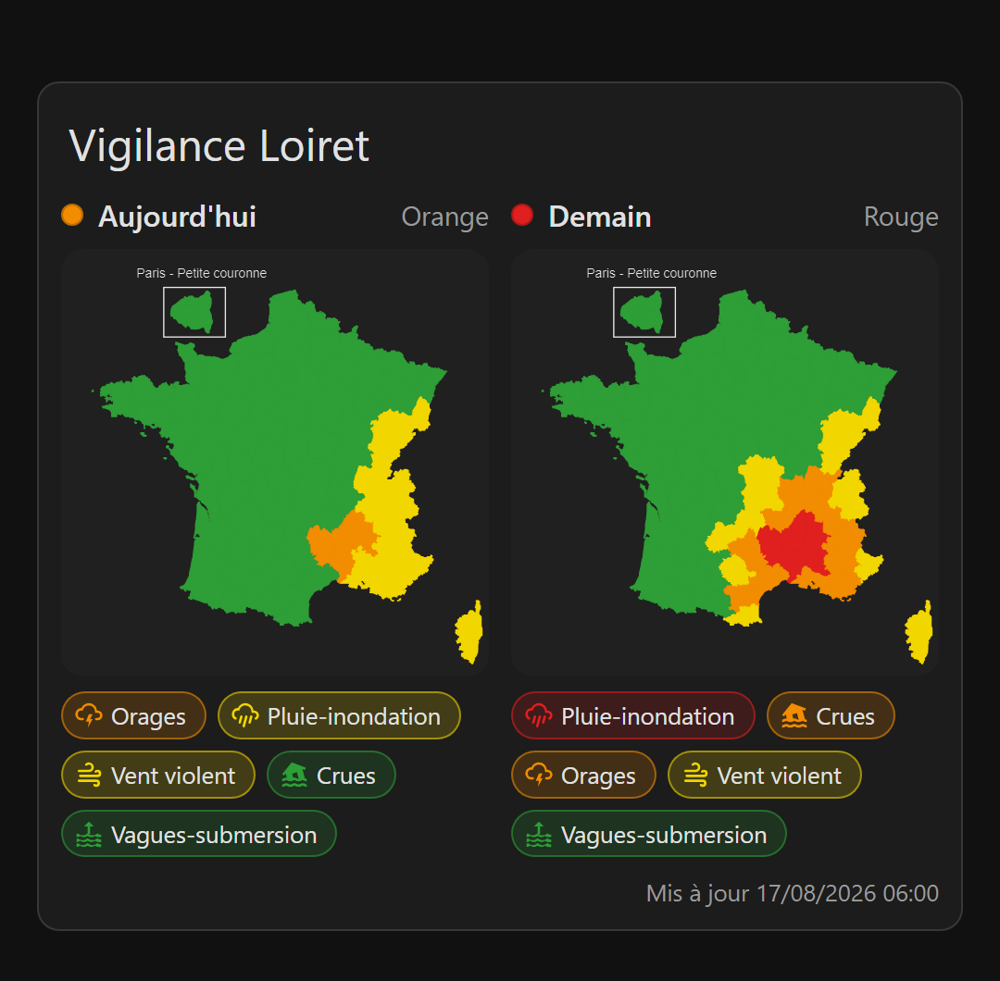 |

---

## ✨ Fonctionnalités

- **Configuration entièrement graphique** : clé d'API, départements, cartes
  nationales, intervalle — rien à écrire en YAML.
- **Deux capteurs par département** (aujourd'hui / demain) : l'état est la
  couleur de vigilance (`green`, `yellow`, `orange`, `red`), traduite par Home
  Assistant ; les phénomènes, leurs créneaux horaires et le commentaire
  national sont en attributs.
- **Deux carte de France** pour les données nationales J et J+1, gardées en mémoire —
  rien n'est écrit dans `www/`.
- **Carte Lovelace embarquée** : servie et enregistrée automatiquement par le
  composant, aucune ressource à déclarer, aucune dépendance (ni mushroom, ni
  auto-entities, ni card-mod).
- **4 dispositions × 4 thèmes** choisis en vignettes cliquables dans l'éditeur
  graphique — dont la **chronologie**, une barre de 24 h par phénomène qui
  n'existait pas dans le montage HACF.
- **Action `refresh`** pour forcer une mise à jour, et **rattrapage
  automatique des bulletins périmés** — relancé à un instant aléatoire sur
  30 minutes pour ménager l'API.
- **Veille de version** : si Météo France déploie une vigilance inconnue du
  composant (V7…) ou un phénomène inédit, l'écart est signalé dans le journal
  et dans **Paramètres → Réparations**, au lieu de passer inaperçu.
- **Thème sombre géré** : l'encre de la vignette officielle (frontières,
  numéros, encart parisien) est re-encrée en clair automatiquement.
- **Bilingue** : intégration, carte et éditeur suivent la langue de Home
  Assistant (français / anglais).

---

## 🚨 Les quatre niveaux

L'état du capteur est la couleur la plus grave du département ; chaque
phénomène garde la sienne.

| Thème clair | Thème sombre |
|:---:|:---:|
| 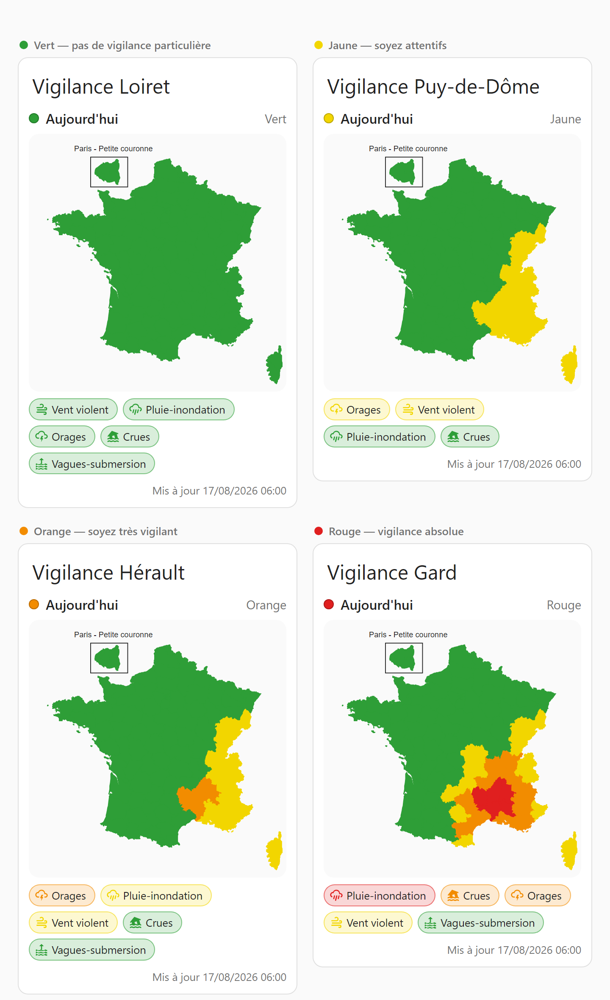 | 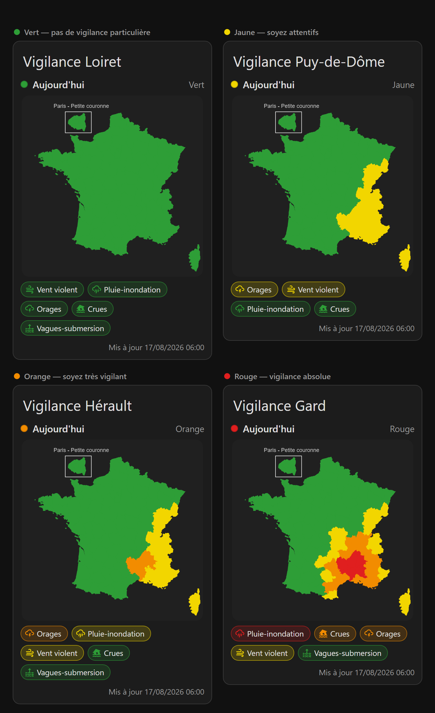 |

---

## 📦 Installation

### Via HACS (recommandé)

[](https://my.home-assistant.io/redirect/hacs_repository/?owner=Pulpyyyy&repository=meteo_france_vigilance&category=integration)

1. HACS → menu **⋮** → **Dépôts personnalisés**.
2. Dépôt : `https://github.com/Pulpyyyy/meteo_france_vigilance`, type
   **Intégration**.
3. Rechercher **Vigilance Météo France**, télécharger, puis redémarrer Home
   Assistant.

### Manuelle

1. Copier `custom_components/meteo_france_vigilance/` dans le dossier
   `custom_components/` de votre configuration.
2. Redémarrer Home Assistant.

> Nécessite Home Assistant **2024.11** ou plus récent.

### Obtenir la clé d'API (gratuite)

1. Créer un compte sur
   [portail-api.meteofrance.fr](https://portail-api.meteofrance.fr) (icône de
   connexion en haut à droite → créer un compte), puis valider l'e-mail reçu.
2. Dans le catalogue des API, ouvrir **Données Publiques Vigilance**
   (« DonneesPubliquesVigilance ») et cliquer **« Souscrire à l'API
   gratuitement »** (offre gratuite, 60 requêtes/min).
3. Sur la page de l'API, générer la clé en choisissant le mode **API Key** —
   pas le token OAuth2 « Generate Token », qui expire au bout d'une heure.
   Indiquer la durée de validité souhaitée (`0` = illimitée).
4. **Copier la clé immédiatement** : le portail ne la réaffichera plus.

> Peu importe si la clé est collée avec son préfixe `Bearer` : l'intégration
> le retire d'elle-même.

### Première configuration

1. **Paramètres → Appareils et services → Ajouter une intégration →
   « Vigilance Météo France »**.
2. Saisir la clé d'API et choisir les départements.

Aucune ressource Lovelace à déclarer : le composant sert la carte à
`/meteo_france_vigilance_frontend/meteo-france-vigilance-card.js` et
l'enregistre lui-même.

---

## 🧾 Options

Modifiables à tout moment via **Configurer** sur l'entrée (la clé d'API se
change via **Reconfigurer**).

| Option | Défaut | Rôle |
|---|---|---|
| Départements | — | Codes suivis. Les zones littorales se saisissent à la main (`3010`, `6410`…) |
| Cartes nationales | activé | Télécharge les deux imagdes de la carte de France |
| Intervalle | 30 min | De 5 à 720 min. Le bulletin est réémis à 6 h et 16 h, et corrigé entre-temps |

---

## 🧰 Entités

Pour chaque département, un appareil portant deux capteurs :

* `sensor.vigilance_<département>_aujourd_hui`
* `sensor.vigilance_<département>_demain`

État : `green`, `yellow`, `orange`, `red` — une énumération traduite, donc
lisible dans une automatisation (`to: "red"`) comme dans l'historique.

| Attribut | Contenu |
|---|---|
| `color`, `color_id`, `color_name`, `color_hex` | La couleur maximale du département |
| `phenomena` | Tous les phénomènes du bulletin, du plus grave au moins grave |
| `alerts` | Les seuls phénomènes orange ou rouges |
| `expired` | Le bulletin affiché n'est plus dans sa période de validité |
| `begin_time`, `end_time`, `update_time` | Bornes de validité et date d'émission |
| `comment` | Le commentaire national de la carte |
| `today`, `tomorrow` | Les mêmes listes, sous la forme exacte du capteur `command_line` du montage HACF |

Chaque entrée de `phenomena` porte `phenomenon_id`, `phenomenon` (libellé),
`slug`, `icon`, `color`, `color_id`, `color_name`, `color_hex`, `begin_time`,
`end_time` — ces deux derniers bornant le créneau **le plus grave**, pas la
journée entière — et `timeline`, la liste des créneaux colorés de la période
(c'est elle qui alimente la disposition *chronologie* de la carte).

Et sur l'appareil de l'intégration, les deux vignettes nationales :
`camera.vigilance_meteo_france_carte_aujourd_hui` et `…_carte_demain`.

### Action `meteo_france_vigilance.refresh`

Force une mise à jour immédiate du bulletin — et des vignettes s'il a été
réémis — sans attendre l'intervalle configuré. Utile après une coupure
réseau, ou avant une notification qui doit partir avec la carte fraîche :

```yaml
actions:
  - action: meteo_france_vigilance.refresh
```

Sans paramètre : le bulletin est national, une seule entrée de configuration
existe. Si l'intégration n'est pas chargée, l'appel échoue avec un message
traduit plutôt qu'un « service inconnu ». Visible aussi dans **Outils de
développement → Actions**, sous le nom **Rafraîchir**.

> **Rattrapage automatique** : quand le bulletin affiché sort de sa période de
> validité (attribut `expired`), le composant programme lui-même un
> rafraîchissement à un instant **aléatoire dans les 30 minutes** qui suivent.
> Le tirage au sort étale les appels des milliers d'installations qui font le
> même constat à la même heure, au lieu de solliciter l'API Météo France à la
> même seconde. Si le bulletin n'est toujours pas réémis, le cycle suivant
> retire au sort.

---

## 🃏 La carte Lovelace

```yaml
type: custom:meteo-france-vigilance-card
entity: sensor.vigilance_loiret_aujourd_hui
```

C'est tout : le capteur de demain et les deux cartes de France sont retrouvés seuls,
par les attributs que le composant leur donne. Aucun nom d'entité n'est deviné.

### Dispositions — `layout`

| Valeur | Ce qu'elle montre |
|---|---|
| `duo` | Les deux jours à égalité, chacun sa vignette. Défaut. |
| `focus` | Aujourd'hui en grand, demain réduit à une ligne. |
| `compact` | Une ligne, sans vignette. Pour empiler des départements. |
| `chronologie` | Une barre de 24 h par phénomène : à quelle heure. |

#### `duo` — le défaut

| Thème clair | Thème sombre |
|:---:|:---:|
| 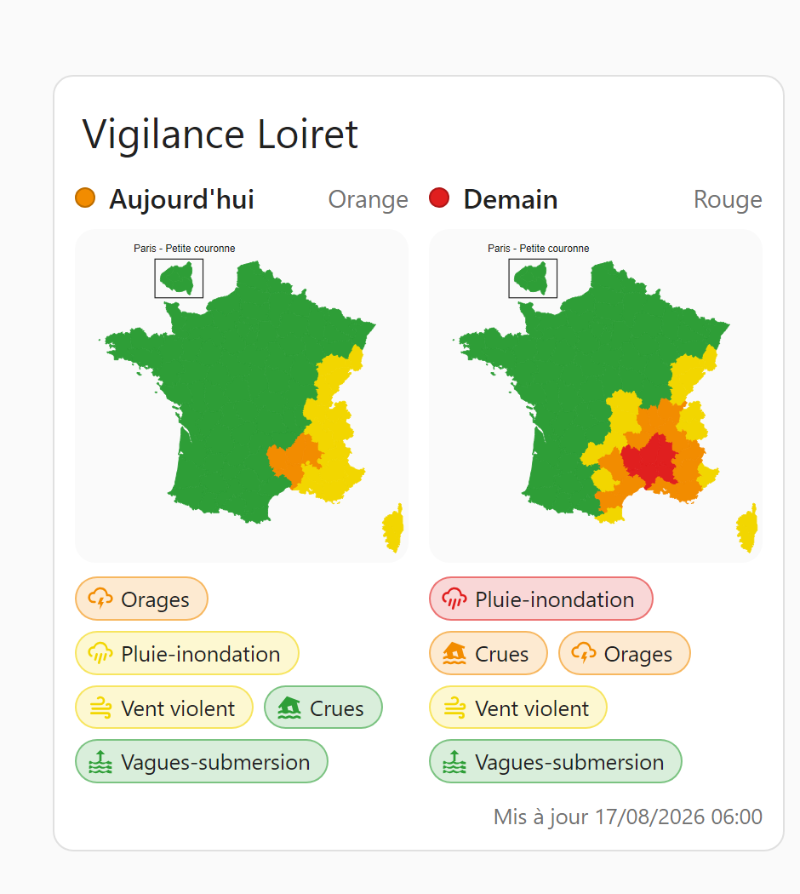 | 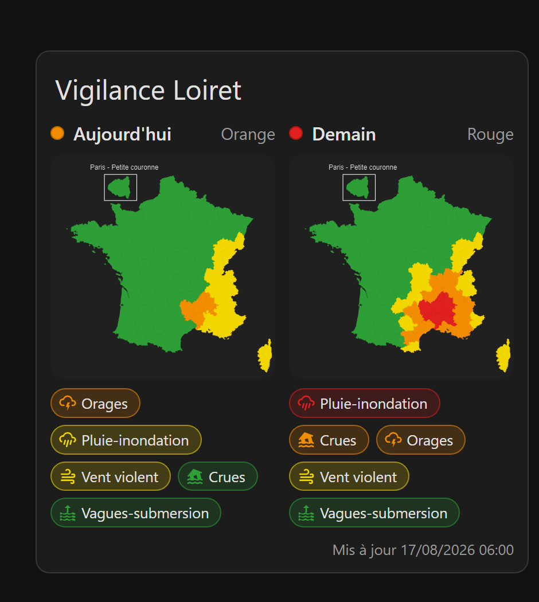 |

#### `focus` — aujourd'hui en grand

| Thème clair | Thème sombre |
|:---:|:---:|
| 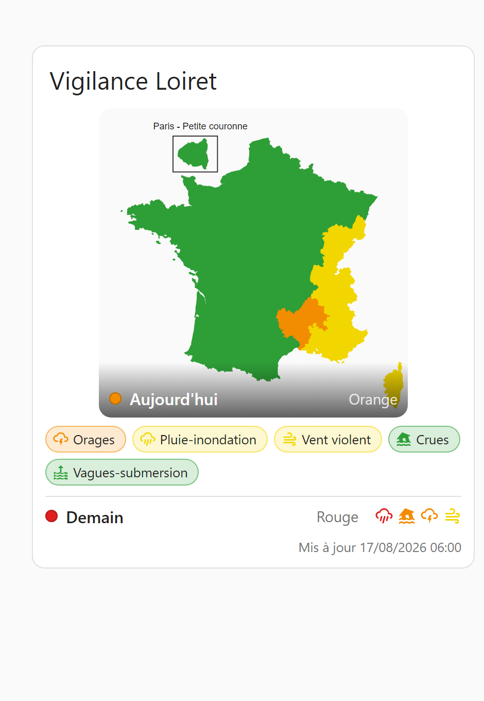 | 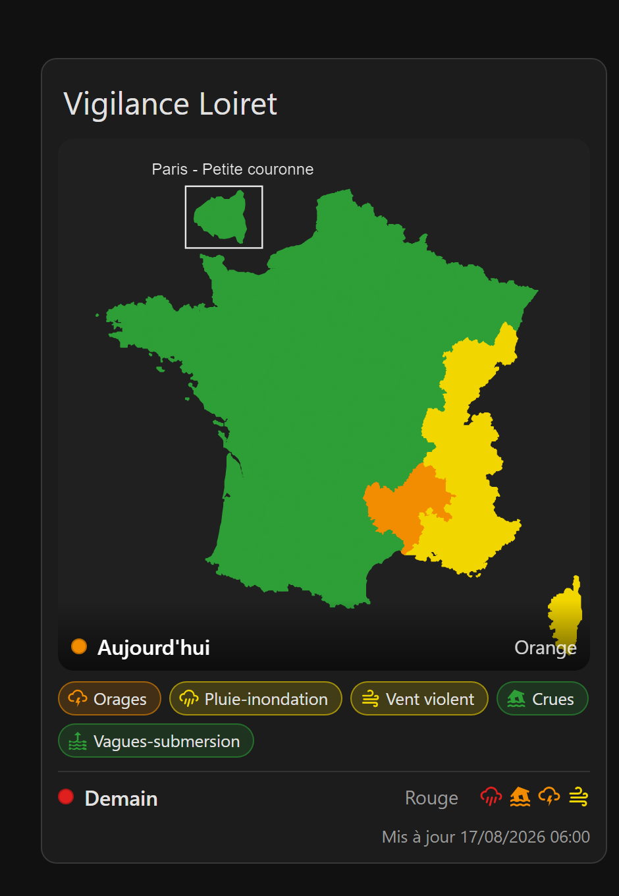 |

#### `compact` — une ligne par jour

| Thème clair | Thème sombre |
|:---:|:---:|
| 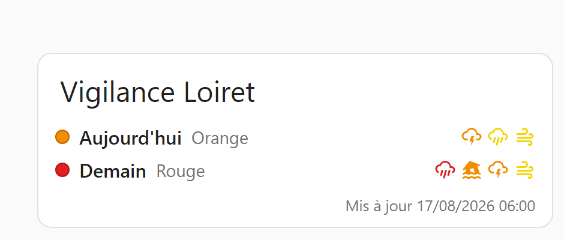 | 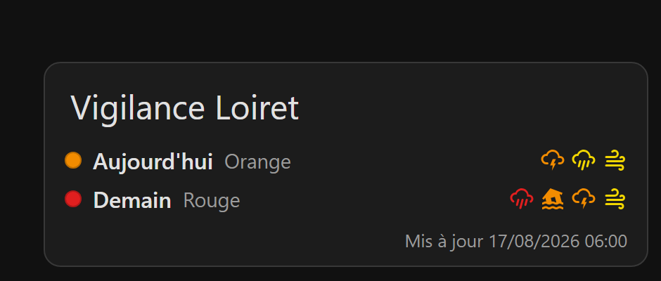 |

#### `chronologie` — quand, pas seulement quoi

> **Nouveauté par rapport au montage HACF** : cette vue n'existait pas. Elle
> exploite l'attribut `timeline` que le composant calcule pour chaque
> phénomène — une barre de 24 h colorée aux heures concernées, les trous
> restant gris.

| Thème clair | Thème sombre |
|:---:|:---:|
| 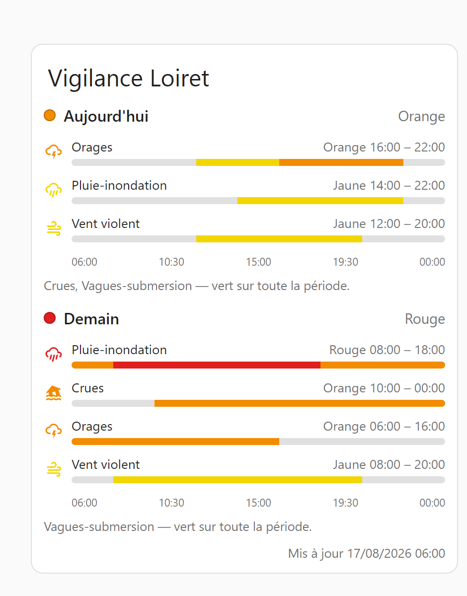 | 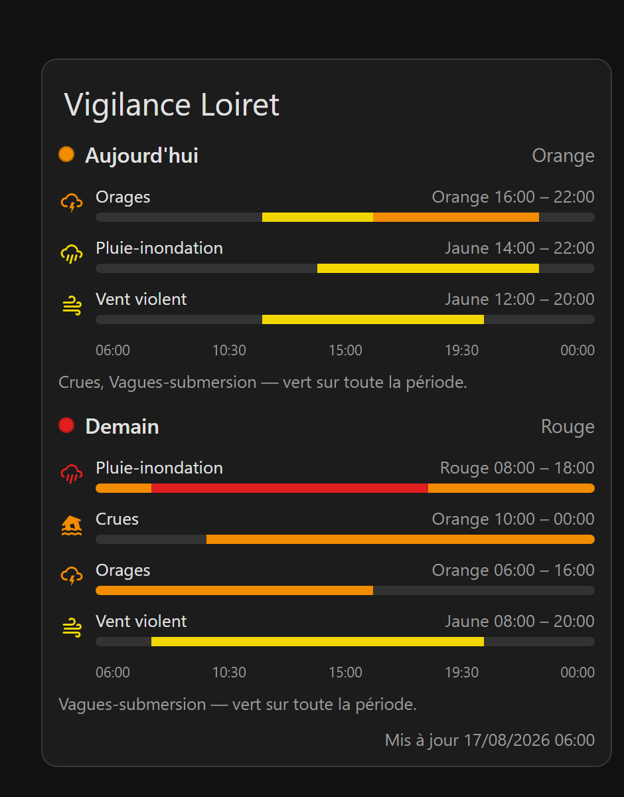 |

### Thèmes — `theme`

| Valeur | La place que prend la couleur |
|---|---|
| `officiel` | Chaque puce porte sa couleur, très atténuée. Défaut. |
| `bandeau` | Une seule couleur, sur la tranche. Se lit de loin. |
| `plein` | La carte prend la couleur de l'alerte, **à partir de l'orange**. |
| `sobre` | Aucun aplat : anneau, soulignement, icône teintée. |

Les deux axes sont indépendants — seize combinaisons.

| Thème clair | Thème sombre |
|:---:|:---:|
| 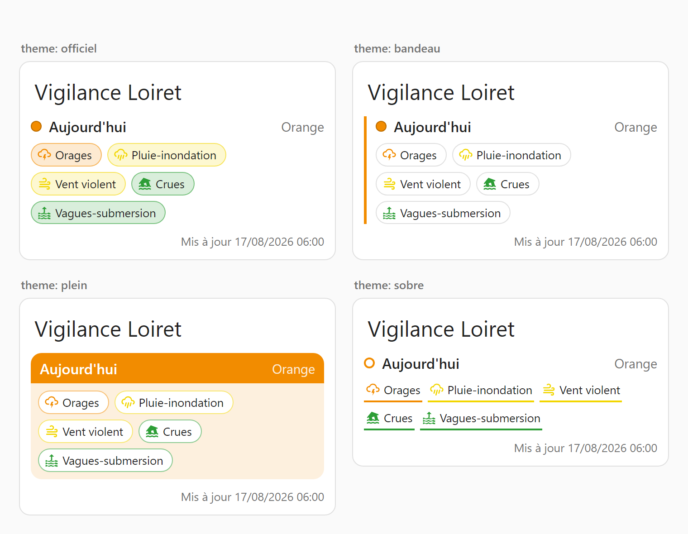 | 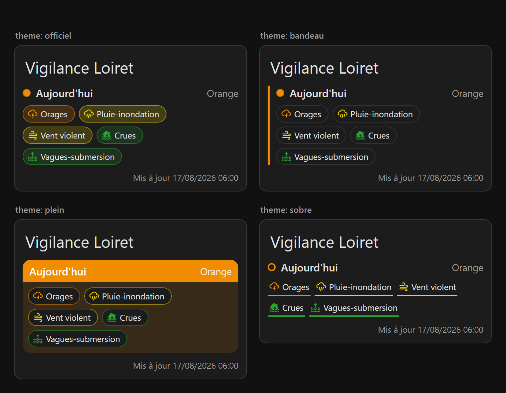 |

### Toutes les options

| Option | Défaut | Rôle |
|---|---|---|
| `entity` | — | Un capteur de vigilance de l'intégration. **Obligatoire.** |
| `title` | `Vigilance <département>` | `""` pour ne pas afficher de titre |
| `periods` | `both` | `both`, `today` ou `tomorrow` |
| `layout` | `duo` | `duo`, `focus`, `compact`, `chronologie` |
| `theme` | `officiel` | `officiel`, `bandeau`, `plein`, `sobre` |
| `show_map` | `true` | La vignette nationale |
| `show_phenomena` | `true` | Les puces de phénomènes |
| `show_comment` | `false` | Le commentaire national de Météo-France |
| `hide_green` | `false` | Ne montrer que ce qui n'est pas vert |
| `alert_only` | `false` | La carte disparaît du tableau de bord tant que rien n'atteint l'orange |
| `hide_map_inset` | `false` | Masque le libellé « Paris - Petite couronne » de la vignette |
| `tap_action` | `more-info` | Action au clic |
| `hold_action` | `more-info` | Action à l'appui long |
| `double_tap_action` | `none` | Action au double clic |

### Actions

La carte parle la même grammaire d'actions que les cartes livrées avec Home
Assistant : `more-info`, `toggle`, `navigate` (+ `navigation_path`), `url`
(+ `url_path`), `perform-action` (+ `perform_action`, `data`, `target`) et
`none`. Par défaut, un clic ouvre la fiche de **ce qui est cliqué** : le
capteur sur le bloc du jour, la carte de France.

```yaml
type: custom:meteo-france-vigilance-card
entity: sensor.vigilance_loiret_aujourd_hui
tap_action:
  action: navigate
  navigation_path: /lovelace/meteo
```

### Éditeur graphique

L'éditeur propose les dispositions et les thèmes en **vignettes cliquables**,
avec l'aperçu réel de Home Assistant qui se met à jour à chaque clic. Il est
**traduit** (français / anglais), comme la carte, selon la langue de Home
Assistant. La carte apparaît dans le sélecteur sous « Vigilance Météo
France », et se pré-remplit avec l'entité depuis laquelle elle est ajoutée.

Exemple, un badge en tête de vue :

```yaml
type: custom:meteo-france-vigilance-card
entity: sensor.vigilance_loiret_aujourd_hui
layout: compact
theme: bandeau
periods: today
```

---

## 🤖 Automatisation

```yaml
triggers:
  - trigger: state
    entity_id: sensor.vigilance_loiret_aujourd_hui
    to: ["orange", "red"]
actions:
  - action: notify.persistent_notification
    data:
      message: >-
        Vigilance {{ state_attr(trigger.entity_id, 'color_name') }} :
        {{ state_attr(trigger.entity_id, 'alerts')
           | map(attribute='phenomenon') | join(', ') }}
```

---

## 🩹 Ce qui est corrigé par rapport au montage HACF

* **La chronologie** : les créneaux horaires de chaque phénomène, qui
  restaient invisibles dans le montage d'origine.
* **Département retrouvé par son code**, non par sa position (`domain_ids[42]`) :
  l'ordre du tableau change d'un bulletin à l'autre.
* **Bulletin périmé signalé** (`expired`) : une carte hors de sa validité
  annonce « vert » alors qu'une alerte est en cours — le défaut à l'origine de
  tous les contournements publiés sur le forum HACF.
* **Nouveaux essais dans le client HTTP**, plus dans une boucle `while` de
  shell ni dans une automatisation toutes les 5 minutes.
* **Vignettes en mémoire** : plus rien n'est écrit dans `www/`, donc plus rien
  n'est lisible sans authentification, et elles ne sont retéléchargées que si
  le bulletin a changé.
* **Clé d'API dans l'entrée de configuration**, plus en clair dans un YAML.

---

## 📄 Licence

[MIT](LICENSE) — les données de vigilance restent la propriété de
[Météo-France](https://meteofrance.com) (attribution requise par les
conditions du portail API).
